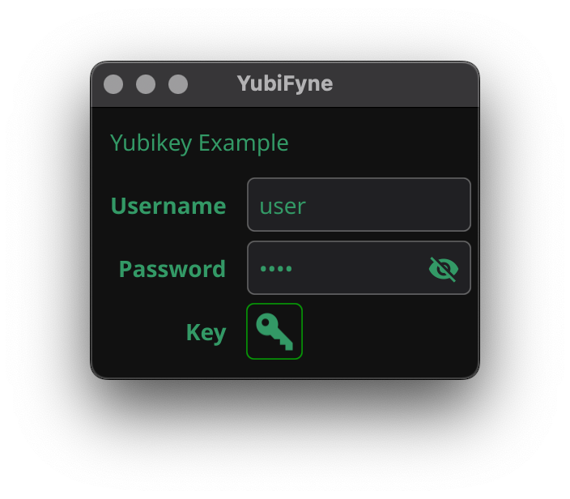

# YubiFyne

A simple demo of how to integrate YubiKey into a Fyne app.

## Usage

After you grab the code you will need an API key from Yubico.
Head to https://upgrade.yubico.com/getapikey/ and get the id and
secret key... Add them to `main.gui.go` in the `auth` method.

Then just run the code

```
go mod tidy
go run .
```

## Screenshot



